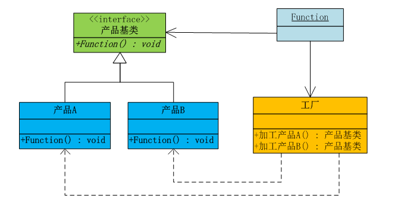
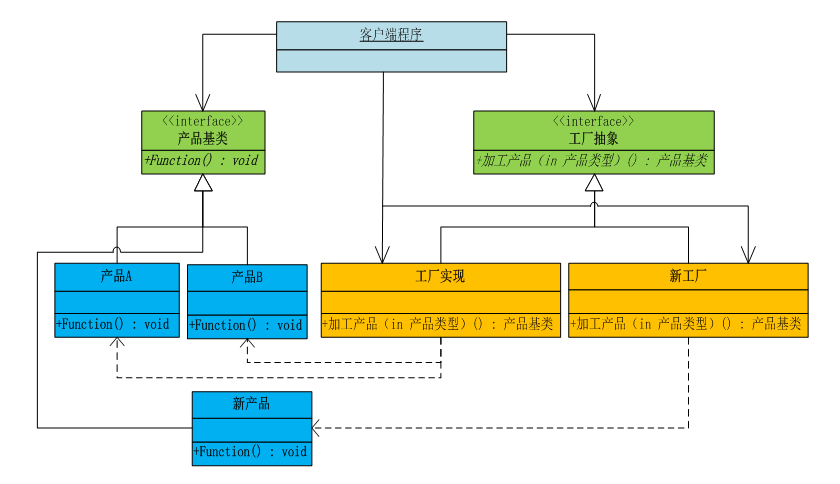
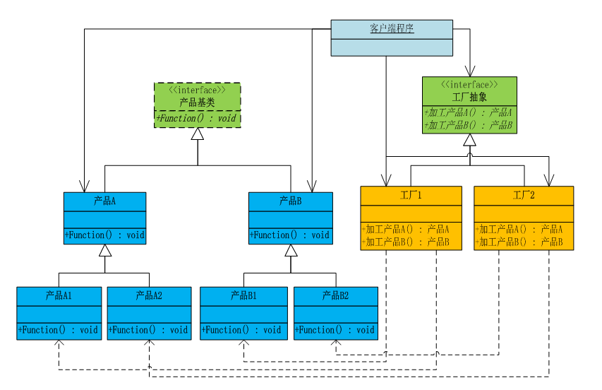

# 为何使用？
工厂模式专门负责将大量有共同接口的类实例化。工厂模式可以动态决定将哪一个类实例化，不必事先知道每次要实例化哪一个类。工厂模式有以下几种形态：

1. 简单工厂模式（`Simple Factory`）
2. 工厂方法模式（`Factory Method`）
3. 抽象工厂模式（`Abstract Factory`）

**为什么工厂模式是如此常用？** 因为工厂模式就相当于创建实例对象的new，我们经常要根据类class生成实例对象，如`A a = new A()` 工厂模式也是用来创建实例对象的，所以以后new时就要多个心眼，是否可以考虑使用工厂模式，虽然这样做，可能多做一些工作，但会给你系统带来更大的可扩展性和尽量少的修改量。

设计模式的原则：
1. 开闭法则
2. 里氏代换法则
3. 依赖倒置法则
4. 接口隔离法则
5. 合成/聚合复用法则
6. 迪米特法则

在以后所有模式的例子中都有客户程序，客户程序这个角色不是模式本身的内容，但是正是这个客户程序完成了对模式的使用。


# 简单工厂模式
它的主要特点是需要在工厂类中做判断，从而创造相应的产品。当增加新的产品时，就需要修改工厂类。有点抽象，举个例子就明白了。有一家生产处理器核的厂家，它只有一个工厂，能够生产两种型号的处理器核。客户需要什么样的处理器核，一定要显示地告诉生产工厂。

`Simple Factory`模式根据提供给它的数据，返回几个可能类中的一个类的实例。通常它返回的类都有一个公共的父类和公共的方法。

> `Simple Factory`模式实际上不是GoF 23个设计模式中的一员。


## 隐喻
如果你想吃饭了，怎么办？自己做吗？自己做就相当于程序中直接使用new。当然是自己下个指令，别人来做更爽。那就把做饭的任务交给你的老婆吧，那么她就是一个做饭的工厂了，你告诉她要吃红烧肉，等会她就从厨房给你端出来一盘香喷喷的红烧肉了，再来个清蒸鱼吧，大鱼大肉不能太多，那就再来个爆炒空心菜，最后再来个西红柿鸡蛋汤。

显然，到了这里，你是Client，你老婆就是Factory，她拥有做红烧肉的方法，做清蒸鱼的方法，做爆炒空心菜、西红柿鸡蛋汤的方法，这些方法返回值就是食物抽象。红烧肉、清蒸鱼、爆炒空心菜、西红柿鸡蛋汤就是食物的继承类，到这里你就可以大吃二喝了。简单工厂模式也成型了。哈哈，娶一个手艺不错的老婆还真好，吃的好，吃的爽，又清闲。


## UML模型图
将一系列拥有共同特征的产品进行抽象，得到产品基类。



## 角色分析

### 1. 产品基类
工厂创建的所有产品的基类, 它负责描述所有实例所共有的公共接口。它用来作为工厂方法的返回参数。一个系列的产品的基类。
定义简单工厂创建的对象的父类或它们共同拥有的接口。可以是一个类、抽象类或接口。
```c++
// Product.h
class CProduct
{
protected:
	CProduct() {}
public:
	virtual ~CProduct() {}

public:
	virtual void Function() = 0;
};
```
> 产品基类的代码中构造函数用了`protected`，而没有使用`public`，主要是为了体现编码中的一个最小权限原则。说明此类不许用户直接实例化。虽然这里使用了`virtual void Function() = 0;`， 编译器也会控制不让用户直接实例化，不过我依然认为使用私有化构造函数来保护类不直接实例化是一个良好的编程风格。


### 2. 具体产品类

产品A和产品B，这个角色实现了抽象产品角色所定义的接口，定义工厂具体加工出的对象。

```c++
// ProductA.h
class CProductA : public CProduct
{
public:
	CProductA();
	virtual ~CProductA();

public:
	virtual void Function();
};

// ProductA.cpp
CProductA::CProductA()
{
	cout << "create product A" << endl;
}

CProductA::~CProductA()
{
	cout << "delete product A" << endl;
}

void CProductA::Function()
{
	cout << "function of product A" << endl;
}
```

### 3. 工厂类

工厂类在客户端的直接控制下（CreateProduct方法）创建产品对象。负责具体产品的创建（实例化）。

```c++
// SimpleFactory.h
class CSimpleFactory
{
public:
    CProduct* CreateProductA();
    CProduct* CreateProductB();
};

// SimpleFactory.cpp
CProduct* CSimpleFactory::CreateProductA()
{
	return new CProductA();
}

CProduct* CSimpleFactory::CreateProductB()
{
	return new CProductB();
}
```

### 4. 客户端程序

访问的角色包括产品基类、工厂类。不直接访问具体产品类。通过基类指针的多态实现产品功能的调用。
客户程序通过调用工厂的方法返回抽象产品，然后执行产品的方法。

代码实现：
```c++
CSimpleFactory simpleFactory;
CProduct *pProduct = NULL;

pProduct = simpleFactory.CreateProductA();
pProduct->Function();
delete pProduct, pProduct = NULL;

pProduct = simpleFactory.CreateProductB();
pProduct->Function();
delete pProduct, pProduct = NULL;
```

## 演化
1. 除了上面的用法外，在有些情况下`Simple Factory`可以由抽象产品角色扮演，一个抽象产品类同时是子类的工厂。
2. 三个角色合并，与单件模式（Singleton）相近，但是有区别。

## 优点
1. 首先解决了代码中大量new的问题；
2. 用工厂方法在一个类的内部创建对象通常比直接创建对象更灵活；
3. 工厂类含有必要的判断逻辑，可以决定在什么时候创建哪一个产品类的实例，客户端可以免除直接创建产品对象的责任，而仅仅"消费"产品。简单工厂模式通过这种做法实现了对责任的分割。

## 缺点
1. 对修改不封闭，新增加产品时，要修改工厂。违法了鼎鼎大名的开闭法则（OCP）。
2. 当产品有复杂的多层等级结构时，工厂类只有自己，以不变应万变，就是模式的缺点。因为工厂类集中了所有产品创建逻辑，一旦不能正常工作，整个系统都要受到影响。
3. 同时，系统扩展困难，一旦添加新产品就不得不修改工厂逻辑，有可能造成工厂逻辑过于复杂。
4. 另外，简单工厂模式通常使用静态工厂方法，这使得无法由子类继承，造成工厂角色无法形成基于继承的等级结构。


# 工厂方法模式

## 隐喻
人是最贪得无厌的动物，老婆手艺再好，总有不会做的菜，你想吃回锅肉，怎么办，让老婆学呗，于是就给她就新增了做回锅肉的方法，以后你再想吃一个新菜，就要给你老婆新加一个方法，显然用老婆做菜的缺点也就暴露出来了，用程序设计的描述就是对修改永远不能封闭。当然优点也是有的，你有了老婆这个工厂，这些菜不用你自己做了，只要直接调用老婆这个工厂的方法就可以了。

面对上面对修改不能封闭的问题，有没有好的解决方案吗？如果你有钱，问题就迎刃而解了，把老婆抽象变成一个基类，你多娶几个具体的老婆，分别有做鱼的，做青菜的，炖汤的老婆，如果你想吃一个新菜，就再新找个女人，从你的老婆基类继承一下，让她来做这个新菜。显然多多的老婆这是所有男人的梦想，没有办法，法律不允许，那么咱们只是为了做饭，老婆这个抽象类咱们不叫老婆了，叫做厨师吧，她的子类也自然而然的该叫做鱼的厨师、炖汤的厨师了。

现在再来分析现在的模式，显然简单工厂的缺陷解决了，新增加一个菜只需要新增加一个厨师就行了，原来的厨师还在做原来的工作，这样你的设计就对修改封闭了。你看把老婆解放出来，招聘大量的厨师到你家里这个方案多么的完美，你老婆也会爱死你了。当然前提就是你要有多多的钱噢，当然这里的钱的多少在软件领域应该看你的客户软件投资方的要求。 

## UML模型
标准工厂模式的UML模型。定义一个用户创建对象的接口，让子类决定实例化哪一个类。Factory Method使一个类的实例化延迟到其子类。



## 角色分析

### 1. 产品基类
同简单工厂的产品基类，其实用的是与简单工厂中的是同一个类，这里并没有重写。

### 2. 具体产品类
也是用的简单工厂的具体产品类，为了体现对修改的关闭这里为系统新添加了一个具体产品类，就是“新产品”，代码中叫做“ConcreteProductNew”。

### 3. 工厂基类
定义了工厂创建产品的接口，但是没有实现，具体创建工作由其继承类实现。

代码实例：
```c++
// Factory.h
class CFactory
{
protected:
	CFactory() {}
public:
	virtual ~CFactory() {}

public:
	virtual CProduct* CreateProduct() = 0;
};
```
### 4. 具体工厂类
工厂基类的具体实现，由此类决定创建具体产品。`CFactoryConcrete`对应于图中的工厂实现，`CFactoryConcreteNew`对应于图中的新工厂。

```c++
// Factory.cpp
// 工厂实现
class CFactoryConcrete : public CFactory
{
public:
	CFactoryConcrete() {}
	virtual ~CFactoryConcrete() {}

public :
	virtual CProduct* CreateProduct();
};

// 新工厂
class CFactoryConcreteNew : public CFactory
{
public:
	CFactoryConcreteNew() {}
	virtual ~CFactoryConcreteNew() {}

public :
	virtual CProduct* CreateProduct();
};

// Factory.cpp
CProduct* CFactoryConcrete::CreateProduct()
{
    return new CProductA();
}

CProduct* CFactoryConcreteNew::CreateProduct()
{
	return new CProductNew();
}
```

### 5. 客户端
访问角色：产品基类、工厂基类、工厂实现类；

调用描述：客户程序通过工厂基类的方法调用工厂实现类来创建所需要的具体产品，从而实现产品功能的访问。

代码实现：
```c++
CProduct *pProduct = NULL;
CFactory *pFactory = NULL;
pFactory = new CFactoryConcrete();

// 创建产品A
pProduct = pFactory->CreateProduct();
pProduct->Function();
delete pProduct, pProduct = NULL;

delete pFactory, pFactory = NULL;

pFactory = new CFactoryConcreteNew();

// 创建新产品
pProduct = pFactory->CreateProduct();
pProduct->Function();
delete pProduct, pProduct = NULL;

delete pFactory, pFactory = NULL;
```

### 优缺点说明
优点：
1. 简单工厂具有的优点
2. 解决了简单工厂的修改不能关闭的问题。系统新增产品，新增一个产品工厂即可，对抽象工厂不受影响

缺点：
1. 对于创建不同系列的产品无能为力、适用性
2. 当一个类不知道它所必须创建的对象的类的时候
3. 当一个类希望由它的子类来指定它所创建的对象的时候
4. 当类将创建对象的职责委托给多个帮助子类中的某一个，并且你希望将哪一个帮助子类是代理者这一信息局部化的时候


# 抽象工厂模式

## 隐喻
世事多变，随着时间的推移，走过的地方越来越多，你天南海北的朋友也越来越多。你发现菜原来还分了许多菜系，鲁菜、粤菜、湘菜等等，它们各有各的风味，同样是红烧肉由不同菜系出来的味道也各不相同，你招待不同的朋友要用不同的菜系，这下难办了，你的厨师都是鲁菜风味，怎么办？广东的朋友来了吃不惯。现在我们再回到简单工厂模式（就是老婆做菜的模式），我们把红烧肉再向下继承，生成鲁菜红烧肉、粤菜红烧肉、湘菜红烧肉；清蒸鱼向下继承为鲁菜清蒸鱼、粤菜清蒸鱼、湘菜清蒸鱼，其它也以此类推。我们也修改一下老婆的这个类，不让其返回食物基类，而是返回红烧肉、清蒸鱼、爆炒空心菜、西红柿鸡蛋汤这一层次，并把这些方法抽象化，作为菜系工厂基类，然后再从此基类继承出，鲁菜工厂、粤菜工厂、湘菜工厂等等，再由这些具体工厂实现创建具体菜的工作，哈哈，你如果招待广东朋友就用粤菜工厂，返回的就是一桌粤菜菜系的红烧肉、清蒸鱼、空心菜和西红柿鸡蛋汤了，你的广东朋友一定会吃的非常合乎胃口了。噢，非常好，你已经实现了抽象工厂模式了。

现在可以看到，想新来做一个菜系，只需新聘请一个厨师就可以了，多么完美，但是你先别高兴太早，如果你想新增加一个菜就变得非常困难了。

意图提供一个创建一系列相关或相互依赖对象的接口，而无需指定它们具体的类。


## UML模型


